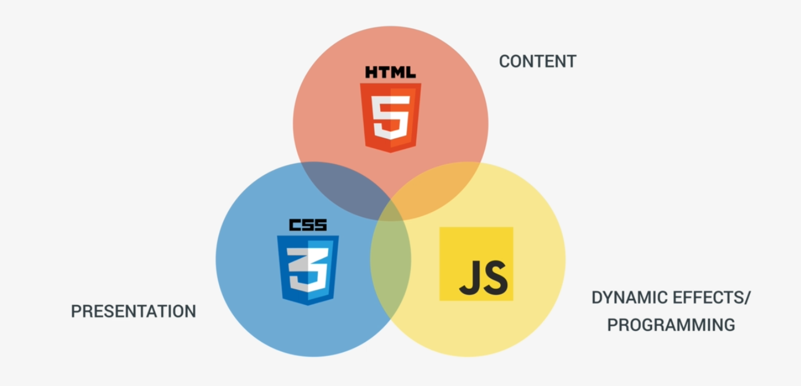
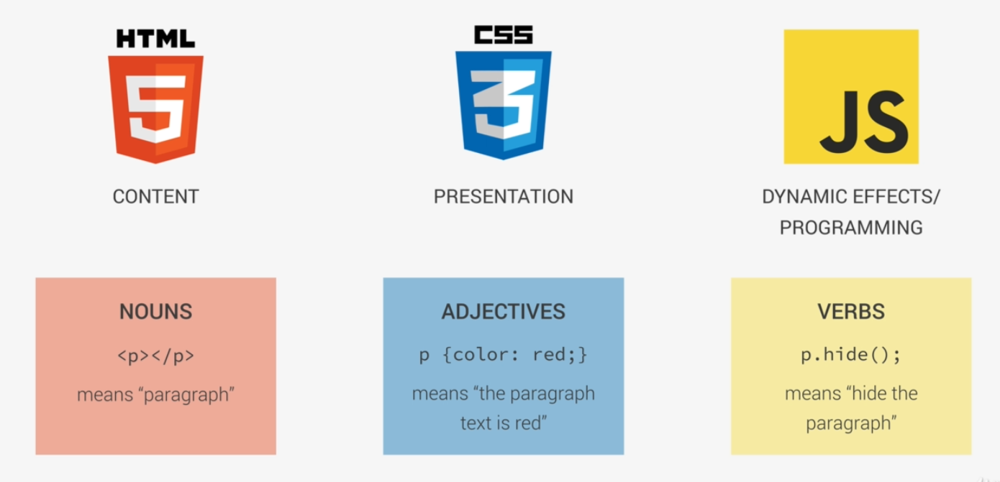

# JavaScript Language Baics

## Contents

1. Introduction
2. What is JavaScript?
3. Variables and DataTypes in JavaScript
4. Comments in JavaScript
5. Varialbe Mutation and Type Coercion
6. Window level funcitons to show and receive data
7. Basic Operators
8. Operator Precedence
9. If-Else statements
10. Switch Statement
11. Truthy and Falsy values and Equaly Operator
12. Functions
13. Arrays
14. Objects and Properties
15. Loops and Iteration

## Introduction

Let's look at the started HTML file which we'll be using for the project:

```HTML
<!DOCTYPE html>
<html lang="en">
  <head>
    <meta charset="UTF-8" />
    <meta name="viewport" content="width=device-width, initial-scale=1.0" />
    <meta http-equiv="X-UA-Compatible" content="ie=edge" />
    <title>JavaScript Fundamentals – Part 1</title>
    <style>
      body {
        height: 100vh;
        display: flex;
        align-items: center;
        background: linear-gradient(to top left, #28b487, #7dd56f);
      }
      h1 {
        font-family: sans-serif;
        font-size: 50px;
        line-height: 1.3;
        width: 100%;
        padding: 30px;
        text-align: center;
        color: white;
      }
    </style>
  </head>
  <body>
    <h1>JavaScript Fundamentals – Part 1</h1>
  </body>
</html>
```

Here, we have two ways to add inline JavaScript code to this file, by either using a `<script></script>` tag or using an external `.js` file..

Let's look at how to add inline javascript:

```HTML
<script>
    console.log('Hello World');
</script>
```

For an external file, we create a new file called `script.js` and then we write the code there:

```javascript
console.log('Hello World');
```

To add this file to the HTML, the tag will be like this;

```HTML
<script src="script.js"></script>
```

From now on, we'll use javascript from the external file as this will allow us to separate from the HTML source.

## What is JavaScript

- JavaScript is a lightweight cross-platform, object-oriented computer programming language.
- Javascript is one of the three core technologies of web development.
- Today JavaScript can be used in different places:

  - Client-Side: JavaScript was traditionally only used in the browser
  - Server-Side: Thanks to Node.js, we can use JavaScript on the server as well.

- JavaScript is what made modern web development possible:

  - Dynamic effects and interactivity
  - Modern web applications that we interact with.

- Frameworks/libraries like React and Angular are 100% based on JavaScript: you need to master JavaScript in order to use them.

Together with HTML and CSS, JavaScript is one of the core technologies of the web.



Another way to visualize which technology is used for:



## Variables and DataTypes in JavaScript

Variable is a name given to a memory location where some data is stored. To use that value stored, we'll use the name of the memory location where it is stored.

### Declaring and initializing a variable in JS

```javascript
var firstName = 'Umang';
```

It's best practise to give a variable a meaningful name and not a random variable name. The best practise is to start with small case and then go camel casing.

__Rules around naming variables:__

- Variable names cannot start with numbers.
- Variable names cannot contain the special symbols other than `_` & `$`.
- Variable names cannot be used which are reserved by the language. Example: 'function', 'true', etc.

### DataTypes in JavaScript

In JS, there are five primitive data-types:

1. __Number:__ Floating point numbers, for decimals and integers.
2. __String:__ Sequence of characters, used for text.
3. __Boolean:__ Logical data types that can only be _true_ or _false_.
4. __Undefined:__ Data type of a variable that does not have a value yet.
5. __Null:__ Also means 'non-existent'.

JavaScript has dynamic typing: Data types are automatically assigned to variables based on the values that the variable holds. The type of the variable also changes if at a later point, the type of the value changed in the variable is changed.

When declaring a variable and trying to access it's value without initializing it, it'll give `undefined`. __undefined__ means that the value has not been assigned yet to the variable. Example:

```javascript
var job;
console.log(job);
```

```output
undefined
```

## Comments

There are two types of comments in JavaScript:

- Single Line Comment:

```javascript
// This is a single line of comment
```

- Multi-line comments:

```javascript
/*
* This is a multi-line comment.
*/
```

## Varialbe Mutation and Type Coercion

Let's look at the example below:

```javascript
var firstName = 'Umang';
var age = 27;

console.log(firstName + ' ' + age);
```

```output
Umang 27
```

This means that JavaScript converts the type from one type to another when needed. In the above example, the age value was converted from number to string when printing. This is called __Type Coercion__.

__Variable mutation__ is nothing but changing the value of the variable which what earlier declared and defined.

```javascript
var age='Umang Sharma';
```

This also means that it will change the type of the variable as well.

## Window level funcitons to show and receive data

The functions that are performed by the browser window are as follows:

- __alert():__ This method alerts the user whatever information we provide inside the paranthesis.
  Example:
  
  ```javascript

  alert('Hello world!');
  ```

  The output of this will be different compared to the console log. This will print information in a different window, whereas `console.log()` will give out output in the developers console.

- __prompt():__ This method prompts the user to give some input in a different window.
  Example:

  ```javascript
  var lastName = prompt("What's your last name?");
  console.log(lastName);
  ```

## Basic Operators

### Arithmetic Operators

```javascript
+, -, *, /, %.
```

### Relational Operators

```javascript
>, <, >=, <=, ==, !=, ===
```

__NOTE:__ Two two different equality operators are `==` and `===`. The difference between these is that, when we use `==`, it does the type coercion. Which means that the type is automatically changed by javascript to match and compare the udpated values. When using `===`, they are compared with not only values but also it's type- complete equality checking.

Example:

```javascript
var height = 23;
if (height == '23') {
  console.log('The == operator does type coercion!.');    // This will be the output as '23' is converted to number 23 for equality check and hence returns true.
}
```

### Logical Operators

```javascript
&&, ||, !
```

### Ternary operator

```javascript
var firstName, age;
firstName = 'John';
age = 16;
age >= 18 ? console.log(firstName + 'drinks beer.') : console.log(firstName + 'drinks juice.');
```

### `typeof` Operator

```javascript
var firstName, lastName, age, isOlder;
firstName = 'John';
age = 27;
isOlder = true;
console.log(typeof(firstName));     // O/P: string
console.log(typeof(lastName));      // O/P: undefined
console.log(typeof(age));           // O/P: number
console.log(typeof(isOlder));       // O/P: boolean
```

### Shorthand notation

```javascript
var x = 5;
x += 5;
console.log(x); // O/P: 10
```

### Increment or Decrement Operators

```javascript
var x = y = 5;
x++;  // post increment
++y;  // pre increment

console.log(x, y); // O/P: 6 6
```

## Operator Precedence

Operator Precedence means that when more than one operator is written within same level (one level paranthesis), which operator's operation will be performed on is decieded by operator's precedence in the table.

The precedence table can be found [here](https://developer.mozilla.org/en-US/docs/Web/JavaScript/Reference/Operators/Operator_Precedence).

The higher the precedence in this table first that operator will be executed upon, and if the precedence is same, then the execution will be taken care on the basis of associativity of the opertor with respect to the operators it's operating upon.

To override the precedence, we use paranthesis.

Multiple assignments also work in javascript because the `=` operator has a right-to-left associativity.

## If-Else statements

Execute one or the other based on the logical operation. Example:

```javascript
var firstName = 'John';
var civilStatus = 'single';

if (civilStatus === 'married') {
  console.log(firstName + ' is married');
} else {
  console.log(firstName + 'will hopefully marry soon.');
}
```

This else block will be executed in this scenario. We can also chain more than one if to the condition and make the condition a lot more complex with more else ifs.

## Switch Statement

Performing multiple logical operation checks:

```javascript
var firstName = 'John';
var job = 'teacher';
switch(job) {
  case 'teacher':
  case 'instructor':
    console.log(firstName + ' teaches how to code.');
    break;

  case 'driver':
    console.log(firstName + ' drives an uber in Lisbon.');
    break;
  
  case 'designer':
    console.log(firstName + ' designs beautiful websites.');
    break;

  default:
    console.log(firstName + ' does something else.');
}
```

Another great example of switch:

```javascript
var firstName = 'John';
var age = 15;
switch(true) {
  case age < 13:
    console.log(firstName + ' is a boy.');
    break;

  case age >= 13 && age < 20:
    console.log(firstName + ' is a teenager.');
    break;

  case age >= 20 && age < 30:
    console.log(firstName + ' is a young man.');
    break;

  default:
    console.log(firstName + ' is a man.');
}
```

## Truthy and Falsy values and Equaly Operator

__Falsy values:__ The values which evaluate to false when evaluated in an if-else condition statement.  
  Exmaple: undefined, null, 0, '', NaN

__Truthy values:__ The values that are considered as true when evaluated in an if-else condition statement.  
  Any value which is not falsy.

Example:

```javascript
var height;
if(height) {
  console.log('Variable is defined.');
} else {
  console.log('Variable has not been defined.');
}
```

```output
Variable has not been defined.
```

## Functions

If you want a piece of code that you want to run multiple number of times, you can use the function. Functions are like containers of code to which we can pass arguments which can then return values.
Example:

```javascript
var currentYear = 2021;
function calculateAge(birthYear) {
  return currentYear - birthYear;
}

console.log(calculateAge(1994));
```

## Function Statements and Expresssions

The above definations of the function is called as function statement. But there is one other way to define a function, called __function expression__:

```javascript
var currentYear = 2021;
var calculateAge = function(birthYear) {
  return currentYear - birthYear;
}

console.log(calculateAge(1994));
```

Under the hood, the function expressions work quite differently, but let's look at that later. Statements and Expressions do not only apply to functions, but they are global concepts in javascript.

### Difference between Expressions and Statements

__Expressions:__ JavaScript Expressions are pieces of code that always produce value, no matter how long they are, as long as there is a value. The same goes for any other code which returns a value or an ouput. It can be called as an expression.

__Statements:__ Statements are pieces of code that do not produce or give an immediate value.

## Arrays

Arrays are a data structure that stores data in a continuous memory locations. Arrays are zero based.Example:

```javascript
// Array declaration + initilization
var names = ['John', 'Mark', 'Mary', 'Bob'];
var year = new Array(1990, 1969, 1948);

// Array data retrieval
console.log(names[0]);  // John
console.log(names);     // {4} {"John", "Mark", "Mary", "Bob"}
console.log(names.length);    //4

// Array Data updation
names[1]= 'Ben';
names[5]= 'Umang';
console.log(names);     // (4) {"John", "Ben", "Mary", "Bob", empty, "Umang"}
```

Arrays in JavaScript can also contain elements of different types. Example:

```javascript
var john = ['John', 'Smith', 1990, 'teacher', false];
```

And there are also some methods we can apply to arrays. Thus, arrays internally are objects, as objects can only have methods. They are:

```javascript
var john = ['John', 'Smith', 1990, 'teacher', false];

john.push('blue');    // Adds an element at the end of the array.
console.log(john);    // {6} {"John", "Smith", 1990, "teacher", false, "blue"}

john.unshift('Mr.');  // Adds an element at the beggining of the array.
console.log(john);    // {7} {"Mr.", "John", "Smith", 1990, "teacher", false, "blue"}

john.pop();           // Removes the last element of the array
console.log(john);    // {6} {"Mr.", "John", "Smith", 1990, "teacher", false}

john.shift();         // Removes the first element of the array
console.log(john);    // {5} {"John", "Smith", 1990, "teacher", false}

console.log(john.indexOf(1990));  // Returns the position where the element is in the array. If the value is not present, it'sll return -1.
```

## Objects

Creating an object using an object literal:

```javascript
var john = {
  firstName: 'John',
  lastName: 'Smith',
  birthYear: 1990,
  family: ['Jane', 'Mark', 'Bob', 'Emily'];
  job: 'teacher',
  isMarried: false
}

// To access this, we can either use a dot notation or use it as an index of an array.
console.log(john.firstName);  // O/P: John
console.log(john['lastName']);  // O/P: Smith

var x = 'birthYear';
console.log(john[x]);   // O/P: 1990

// Mutate the object
john.job = 'designer';
john['isMarried'] = true;
```

Creating a new object using the new keyword:

```javascript
var jane = new Object();
jane.firstName = 'Jane';
jane.birthYear = 1994;
jane['lastName'] = 'Smith';
```

Each of the attributes related to an object is called it's property. An object can hold different types of data- string, arrays, other objects. We can even attach functions to an object.

```javascript
var john = {
  firstName: 'John',
  lastName: 'Smith',
  birthYear: 1990,
  family: ['Jane', 'Mark', 'Bob', 'Emily'];
  job: 'teacher',
  isMarried: false,
  calculateAge: function() {
    // 'this' keyword is associated with the object 'john'
    this.age = 2021 - this.birthYear;
  }
}

john.calculateAge();
```

## Loops and Iteration

This helps us execute the same code one or more than one time depending on a condition or a counter. There are three parts to every loop:

- initial value of the counter
- counter condition
- counter update

```javascript
// Example of a for loop:
for (var i = 0; i< 10; i++) [
  console.log(i);
]

// Example of a while loop:
var i = 0;
while(i < john.lenght) {
  console.log(john[i]);
  i++;
}
```

### Continue and break Statements

__Continue__ statement is used to quit the current iteration of the loop and continue with the next iteration.
__Break__ statement is used to quit the loop altogether.
