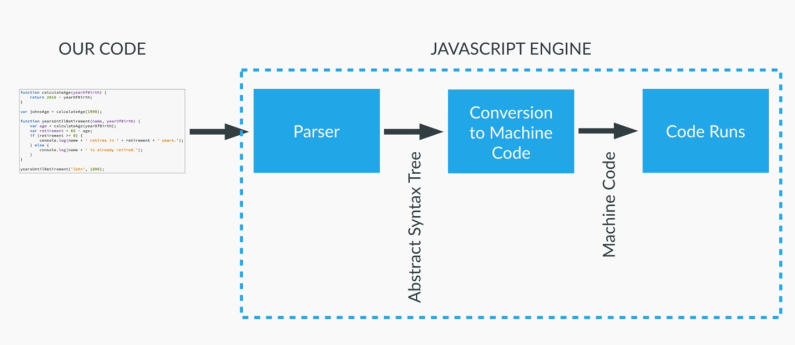
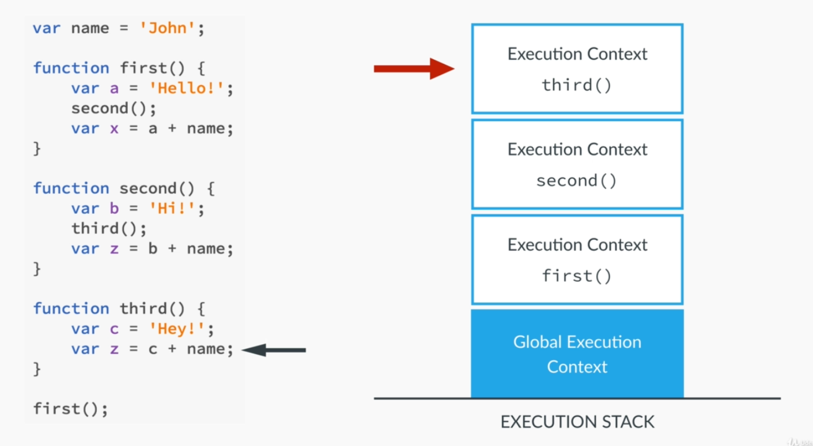
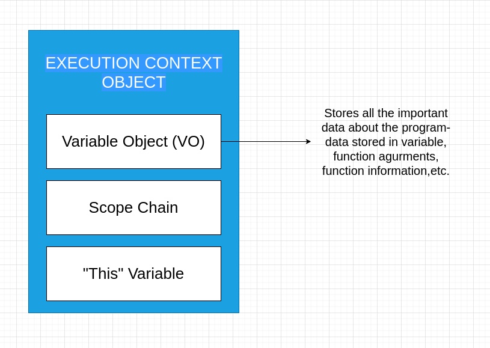
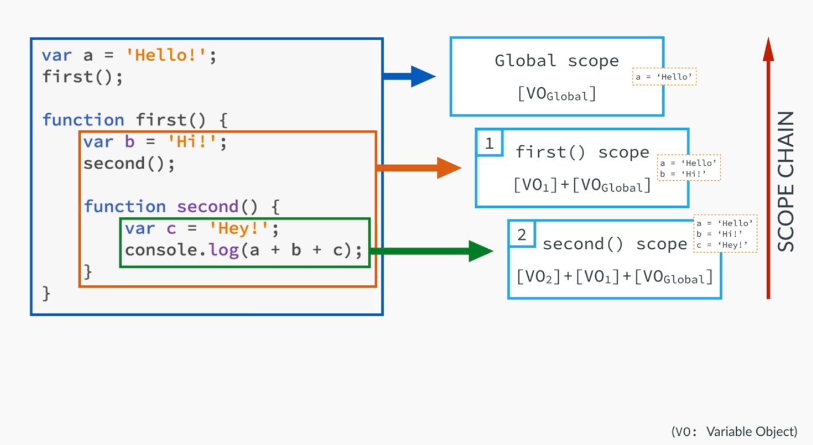
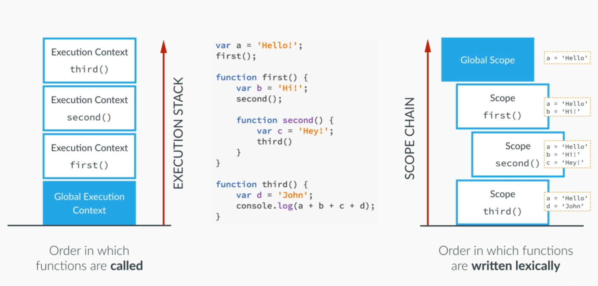

# Contents

1. How our code is Executed: JavaScript Parsers and Engines
2. Execution Contexts and Execution Stack
3. Execution Contexts in Detail: Creation and Execution in phases and Hoisting
4. Hoisting in Practise
5. Scoping and Scope Chain
6. The 'this' Keyword
7. Borrowing of Methods

## How our code is Executed: JavaScript Parsers and Engines

All the JS code that we write is hosted in some environment. In case of client-side javascript, it's the browser, and in case of server-side javascript, it is the V8 engine. The process can be seen from the picture below:



## Execution Contexts and Execution Stack

__Execution Context:__ Execution Context is a box, or a container, or a wrapper which stores variables and in which a piece of our code is evaluated and executed.

The default execution context is the Global Execution Context. Code that is not inside any function is associated to a Global Context, or a global object. In the browser, that's the window object.

Declaring a variable `lastName` or `Window.lastName` is same if it's in the global scope. And as this can be seen that the attribute is attached to the window object as a property.

Each time a function is executed, it gets it's own brand new execution context. This can be seen from the picture below:



As you can see the execution context is generated as per the function calls. The whole Stack is called as Execution Stack. In Java, we can call this as Stacks Frames.

Each variable defined in the function body is stored in it's own execution context.

## Execution Contexts in Detail: Creation and Execution in phases and Hoisting

Let's look at how an execution context is created. We can associate an execution context with an object called as Exection Context Object. This object has three properties:

- Variable Object (VO): Each execution context has an object which stores a lot of important data that the function will use when running and this happens even before the execution starts. This contains the function argurments, inner variable declarations, as well as function declarations.
- Scope Chain: This will contain the current variable objects as well all the variable objects of all it's parents.
- "This" variable: This variable is associated with the current execution context object.

This can be visualized from the picture below:



When a function is called a new execution context is created and put on top of execution stack. This happens in two phases:

- Creation Phase:
  1. Creation of Variable Object(VO).
  2. Creation of the Scrop Chain.
  3. Determine and set value of 'this' object.

- Execution Phase
  The code of the function that generated the current execution context is ran line by line and all the variables are defined.

__NOTE:__ This is what happens when creation of the variable object:

- The argument object is created containing all the arguments that were passed into the function.
- Code is scanned for __function declarations__: for each function, a property is created in the Variable Object, pointing to the function.
- Code is scanned for __variable declarations__: for each variable, a property is creatd in the Variable Object, and set to _undefined_.

The last two points are called as __Hoisting__. Functions and variables are _hoisted_ in javascript. Which means that they are available even before the execution phase starts. They are _hoisted_ in a different way though. The functions are already defined before the execution phase starts, whereas variables are set to _undefined_ and will only be defined during the execution phase.

## Hoisting in Practise

### Hoisting in Functions

Let's look at how hoisting works in real program scenarios:

```javascript
function calculateAge(year) {
  console.log(2021-year);
}

calculateAge(1990);
```

The above program works and consoles out the correct output as well. If we call the function even before we're declaring the function, it'll work the same.

```javascript
calculateAge(1990);

function calculateAge(year) {
  console.log(2021-year);
}
```

This will also work the same as the other one. The reason is that in the creation phase of the Execution Context, in this case the Global Execution Context, even before the execution phase starts the function's information is stored in the Variable Object. During the execution phase, when encountered against it, it'll directly look up the Variable Object, and go the function defination.

__NOTE:__ The function hoisting only works in case of function statements and not function expression. As in expression, a function is defined and then stored in a varialbe, whose value will only be available during the execution phase.

### Hoisting in Variables

Let's look at how hoisting works with variables:

```javascript
var age = 25;
console.log(age);       // O/P: 25
```

But when trying to access this before declaring the variable:

```javascript
console.log(age);       // O/P: undefined
var age = 25;
```

Thus, as stated, the variables are hoisted and set to undefined before they are defined the execution phase.

__NOTE:__ Now, this gives `undefined` because it's hoisted in the Variable Object. If the variable is not defined, it'll straight out give an error staing `ReferenceError: age is not define`.

__NOTE:__ As we can say that the Execution Context can be called as Stack Frame, we can say that each scope is in it's own Execution Context. Example:

```javascript
console.log(age);       // O/P: undefined
var age = 23;

function foo() {
    var age = 65;
    console.log(age);   // O/P: 65  -- Variable associated with foo() method's Execution Context Object.
}

foo();
console.log(age);       // O/P: 23  -- Variable associated with Global Execution Context Object.
```

## Scoping and Scope Chain

Scoping answers this question "Where can we access a certain variable?"

__Each new function creates a scope:__ the space/environment, in which the variables it defines are accessible.

__NOTE:__ In other languages, like Java, a new scope can be created using if/for/while blocks. But in javascript, a new scope can only be created with the creation of a new function.

__NOTE:__ In JavaScript, we also have something called as __Lexical Scoping__. __Lexical Scoping:__ a function that is lexically within another functin gets access to the scope of the outer function.

Let's look at what the scope of each variable is from the picture below:



When in the inner most function, the javascript engine couldn't find the value for both a and b in the current scope, it'll look out of the parent scope, i.e., lexical scoping. This creates a __Scope Chain__ of sorts and thus is called __Scope Chain__.

This does not work backwards, as the global scope will not have access to the variables b and c unless we return the values from their function calls.

In the creation phase, each Execution Context will get their own scope chain where they can see what Variable Objects they have access to. In case of the above example, the Execution Context of the function second() will have access to Variable Object Global, Variable Object of the first() function as well as the Variable Object of the second() function. So, using scope chain, we can find out which variable we have access to.

One more example of how Execution Context and Scope Chain are in place:



In the above picture the program will give an error stating that b and c are undefined. That's because the Scope Chain of the third() function has only access to the Variable Object of the Global Execution Context and not of that of first() and second() methods, where the variables are stored.

## The 'this' Keyword

This is the third step of the Creation phase of an Execution Context. Here, the value of `this` is determined and set. Every execution context has a `this` keyword value associated with it.

- __Regular Function calls:__ the `this` keyword points as the global object, (the window object, in the browser).
- __Method Call__(Function attached to an object): the `this` variable points to the object that is calling the method.

__NOTE:__ The `this` keyword is not defined a value until a function where it is defined is actually called, which falls in line in when a function is called, then only it's Execution Context is created and thus, then only `this` keyword value is assigned.

### `this` keyword in practise

When checking the value of `this` keyword in global context, in terms of a client side application will always give `Window` as that is the object with which the Execution Context is attached to.

```javascript
console.log(this);      // O/P: Window
```

Let's look at some other function call:

```javascript
calculateAge(1990);

function calculateAge(year) {
  console.log(2021-year);   // O/P: 31
  console.log(this);        // O/P: Window - This is a regual function call, and the this keyword is always pointing to the global object.
}
```

Let's look at an Object here:

```javascript
var john = {
    name: 'John',
    yearOfBirth: 1990,
    calculateAge: function() {
        console.log(2021-this.yearOfBirth);     // O/P: 31
        console.log(this);          // O/P: Object {name: "John", yearOfBirth: 1990}

        function innerFunction() {
            console.log(this);      // O/P: Window Object- as this is a regular function call and not a method call and thus is linked to Global Execution Context
        }
        innerFunction();
    }
}
```

## Borrowing of Methods

Methods can be borrowed from one object to another object as a property. For example:

```javascript
var mike = {
    name: 'Mike',
    yearOfBirth: 1984
};

mike.calculateAge = john.calculateAge;
mike.calculateAge();
```

For the above scenario, the `this` keyword for mike object's calculateAge() method, that was borrowed from john object, the `this` will be associated with mike object.
