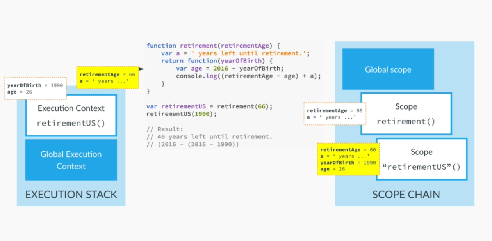

# Contents

1. Everything is an Object: Inheritence and the prototype chain
2. Creating Objects
3. Primitives vs Objects
4. First Class Functions: Passing Functions as arguments
5. First class Functions: Functions returning functions
6. Immediately Invoked Function Expressions(IIFE)
7. Closures
8. Closure Challenge
9. Bind, Call and Apply methods

## Everything is an Object: Inheritence and the prototype chain

In Javascript, everything is an object. Well, everything other than the primitives are objects, be it functions, arrays or Dates.

### Constructors and Instances in JavaScript

What is called a class in other languages(like in Java), in JavaScript, it's called a constructor. So constructor gives us the blueprint to create objects called instances.

In JavaScript, the inheritance concept is also the same, but it is being carried out a little different compared to Java. Each object has a property associated with it called __Prototype__.

As everything in JavaScript is an Object, so even the constructor is an Object in javascript. So, it also has a property associated with it called __Prototype__. Now this property is not of the Person constructor directly, but it is a collective property of all the instances which are created using that constructor. This property will hold the method linked to that constructor. So whenever we create an instance from that constructor, the prototype of the constructor will be made accessible to the newly created object. And thus, it can call that method.

And since the Person constructor is also an Object/instance, it is an instance of a bigger object called Object. Object has it's own prototype which has certain properties, and thus our Person constructor can use these properties. This can be seen in the picture below:


And as you can see there is a chain built on prototypes on what the objects can access, it is called __Prototype Chain__. Due to this prototype chain, Even the John object can access the properties of Object prototype, even though not directly being an instance of object.

So, here's how the whole process works. When we first try to invoke a method using the object, javascript will first try to see if the method is available on the object itself. If the method cannot be found, it'll look for the prototype of it's parent. In the above case, if the property is not found, it'll look for Person object's prototype, and if not found there, it'll look for in it's parent, i.e., Object's prototype. So, it moves up the prototype chain. And it'll try to continue the chain until it reaches null. Null is the only thing in javascript, which doesn't have a prototype. And then undefined is returned.

So, the summary of the above prototype notaion can be summarized here:


## Creating Objects

### Function Constructors

Creating Objects using function constructors:

```javascript
var Person = function(name, yearOfBirth, job) {
    this.name = name;
    this.yearOfBirth = yearOfBirth;
    this.job = job;
}

var john = new Person('John', 1990, 'teacher');
```

How inheritance works in JS: In order to make methods/properties linked to a function constructor, the method needs to be added to it's prototype:

```javascript
Person.prototype.calculateAge= function() {
    return 2021 - this.age;
}
Person.prototype.lastName = 'Smith';
```

This is how inheritance works in JavaScript. So, even though this property not being part of the constructor directly can be added to it's prototype, so whatever object is created using that the Person constructor, it'll have access to the method `calculateAge()`.

### Another way to create object

```javascript
var personProto = {
    calculateAge: function() {
        console.log(2016 - this.yearOfBirth);
    }
};

var john = Object.create(personProto);  // This adds the calculateAge() method to john's prototype, but with empty message

// Adding properties to the object
john.name = 'John';
john.yearOfBirth = 1990;
john.job = 'teacher';


var jane = Object.create(personProto, {
    name: { value: 'Jane' },
    yearOfBirth: { value: 1969 },
    job: { value: 'designer' }
});
```

So the difference between the Function Constructor and Object.create pattern is that the Object.create directly inherits the prototype that we pass in as the argument whereas the Function Constructor inherits from the constructor's prototype property. And the benefit of Object.create is that it allows us to create complex inheritence constructs that with Function Constructors it would n't have been possible.

## Primitives vs Objects

The only difference between Primitives and Objects is that the primitives store the actual value, whereas the values associated with the Objects actually store the reference of the object where its stored. So, at a later point, let's say we pass both the primitives to a function, and the function changes both the values. After the function execution stops, the primitive value that the function changed will be lost, as it will have only changed the value of the variable in it's own Execution Context. But if in a function, we change the value of an object, the value of the object will change even after the function execution stops. That's because, it'll change the original object using it's location.

## First Class Functions: Passing Functions as arguments

Some points related to functions:

- A function in itself is an object. It's an instance of the Object type.
- A function behaves like any other object.
- We can store functions in a variable.
- As it's an object, we can also pass a function as an argument to another function
- And we can return a function from a function.

And because of all that, in JavaScript, we say these type of functions as __First Class Functions__.

Example:

```javascript
var years = [1990, 1995, 2000, 2005, 2006];

function calculateArray(array, func) {
    var arrayRes = [];

    for (var i = 0; i < array.length; i++) {
        arrayRes.push(func(array[i]));
    }

    return arrayRes;
}

function calculateAge(element) {
    return 2021 - element;
}

function isFullAge(element) {
    return element >= 18;
}

var agesOfPeople = calculateArray(years, calculateAge);
console.log(agesOfPeople);

var fullAge = calculateArray(years, isFullAge);
console.log(fullAge);
```

So, here we saw how to pass functions to a function. Now let's see how a function can return another function.

## First class Functions: Functions returning functions

Example:

```javascript
function interviewQuestion(job) {
    if (job === 'designer') {
        return function(name) {
            console.log(name + ', can you please explain what US design is?');
        }
    } else if (job === 'teacher') {
        return function(name) {
            console.log('What subject do you teach. ' + name + '?');
        }
    } else {
        return function(name) {
            console.log('Hello ' + name + ', what do you do?');
        }
    }
}

var designerQuestion = interviewQuestion('designer');
var teacherQuestion = interviewQuestion('teacher');
var otherQuestion = interviewQuestion('tester');

designerQuestion('Umang');
teacherQuestion('John');
otherQuestion('Developer');
```

In the above code, we get the function as a return from another question. This function is stored in a variable and then we call that function using that variable as it's handler/reference. We can call it using a single line as well- without saving the function returned in a variable and directly calling the interviewQuestion, and then passing the name to the returned function right away:

```javascript
interviewQuestion('designer')('Umang');
interviewQuestion('teacher')('Paula');
interviewQuestion('developer')('Erik');
```

This will give the appropriate answer as the output.

## Immediately Invoked Function Expressions(IIFE)

IIFE is a special type of function in JS, which is not a typical function that is used to create re-usable code. It is a function that only runs once during the linear execution phase of the context it's in. Example:

```javascript
(function () {
    console.log('Method only executed once.');
})();
```

Here the method is defined, and is called right after that. And since this method is not assigned to a variable, it cannot be called again. This, also cannot be assigned to a variable. It is needed to be called only once. This is used to create data privacy and so that the code which will be executed inside the function will be called only once, but will need to called in the code linearly. Passing variables to the IFFY:

```javascript
(function (name) {
    console.log('Method only executed once for ' + name + '.');
})('Umang');
```

## Closures

Let's look at the code below:

```javascript
// Write a function that returns a function which calculates how many years we have left until retirement.
 function retirement(retirementAge) {

    var response = 'Years left to retire: ';
     return function(currentAge) {
         console.log( response + (retirementAge - currentAge));
     }
 }

 var indianRetirementAge = retirement(65);
 var euRetirementAge = retirement(65);
 indianRetirementAge(30);
 euRetirementAge(40);
```

When you look at the code, even after we have gotten the response- a function back from the `retirement()` function, when we call the function that it returned, we can still use the variables/data members that were part of the `retirement()` function, like the value of `retirementAge` argument and the value of `response` is used when we call the `indianRetirementAge()` function. This is called __Closure__.

### How this works?

_An inner function has always access to the variables and parameters of it's outer function, even after the outer function has returned_. How it works internally is that, when a normal function returns, the Variable Object is effectively gone. But, in case of closures, that's a little different. In case of closures, even after the function returns and the Execution Context is gone, the Variable Object is still there. It sits in the memory and can be still accessed. And since the Scope Chain is basically a pointer to Variable Objects, since the Variable Object is still in memory, so is the Scope Chain.

Now when the function returned is executed, a new Execution Context is created in the Execution Stack. which has it's own Variable Object with the argument that we passed to it. And since the returned function is written lexically, it has access to the outer function Scope Chain, which is pointing to the Variable Object of the Execution Context which was recently removed from the stack. The current Execution Context has closed in on the outer Varialbe Object so that it can used it. That's the reason, it's called a __Closure__. So, the Scope Chain always stays intact. This can be clearly understood from the image below:



__NOTE:__ Closures are not something that we build manually. This is something that's built into javascript.

## Closure Challenge

### Rewrite the interviewQuestion method using closure that we wrote when working with first class functions returning different function

```javascript
function interviewQuestion(job) {
    return function(name) {
        if (job === 'designer') {
            console.log(name + ', can you please explain what US design is?');
        } else if (job === 'teacher') {
            console.log('What subject do you teach. ' + name + '?');
        } else {
                console.log('Hello ' + name + ', what do you do?');
        }
    }
}

var designerQuestion = interviewQuestion('designer');
var teacherQuestion = interviewQuestion('teacher');
var otherQuestion = interviewQuestion('developer');

designerQuestion('Umang');  // Or interviewQuestion('designer')('Umang');
teacherQuestion('John');    // Or interviewQuestion('teacher')('John');
otherQuestion('Erik');      // Or interviewQuestion('developer')('Erik');
```

## Bind, Call and Apply methods

### call() method

Consider the code below:

```javascript
var john = {
    name: 'John',
    age: 26,
    job: 'teacher',
    presentation: function(style, timeOfDay) {
        if (style === 'formal') {
            console.log('Good ' + timeOfDay + ', ladies and gentlemen! I\'m ' + this.name + ' I\'m a ' + this.job + 'and I\'m ' + this.age + ' years old.');
        } else if (style === 'friendly') {
            console.log('Hey! What\'s up? I\'m ' + this.name + ' I\'m a ' + this.job + ' and I\'m ' + this.age + ' years old.');
        }
    }
};

var emily = {
    name: 'Emily',
    age: 25,
    job: 'designer'
};

john.presentation('friendly', 'morning');
```

Here the emily object doesn't have a presentation object. If we want to borrow the method `presentation()` from John, there are two ways:

1. _(Point 7 of day 2 notes)_ We can just write the code `emily.presentation = john.presentation;` after which if we run the code `emily.presentation('friendly', 'morning');`, it'll give the output as if emily object also has the presentation method associated with it.
2. The other way to do this is by using:

```javascript
john.presentation.call(emily, 'friendly', 'morning');      // the first parameter that's passed is the object which needs to set in 'this': emily in this case. The rest of the parameters will be whatever the arguments the presentation method needed.
```

### apply() method

`apply()` method is similar to what `call()` method does. The only difference between them is that in `apply()`, the first argument is `this` and the next argument is an array of the arguments of which function we're borrowing. Code:

```javascript
john.presentation.apply(emily, ['friendly', 'morning']);
```

### bind() method

`bind()` method is similar to what `call()` method does, but it sets up the `this` property explicitly. `bind()` doesn't call the function right away like `call()` and `apply()` methods call, but instead it generates a copy of the function so that we cas store it somewhere. This creates a function with reset arguments, which can then be stored and called at a later point.

```javascript
var johnFriendly = john.presentation.bind(emily, 'friendly');    // Not binding the timeOfDay argument

// Calling the function which was binded, 
johnFriendly('morning');
johnFriendly('night');  // same works for another time of the day, and only one argument changes. Rest all stays and works the same.
```

This creates a function that can be called at any point of time, and it only needs the second argument to work. So, this is a very useful method. What we did here is called currying in javascript. Usually it is done when a function needs to be called with a lot of arguments and ony one changes at a time, so reducing the large nubmers of arguments to just one makes for more cleaner code.
